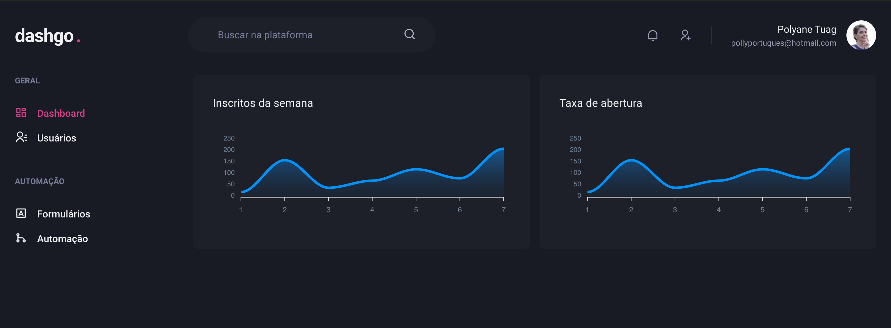
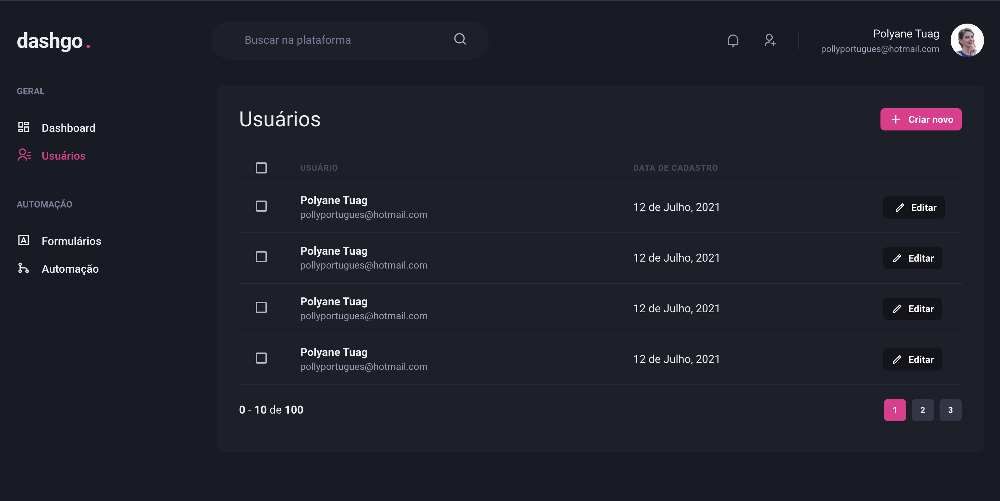

<p align="center">
  <h1 align="center">
    Dashgo 
    📇
<p>dashboard de usuários</p>
  </h1>
</p>

<h3 align="center">  
  <p align="center">
    <a href="#-sobre">Sobre</a>&nbsp;&nbsp;&nbsp;|&nbsp;&nbsp;&nbsp;
    <a href="#-tecnologias">Tecnologias</a>&nbsp;&nbsp;&nbsp;|&nbsp;&nbsp;&nbsp;
    <a href="#-layouts">Layouts</a>&nbsp;&nbsp;&nbsp;|&nbsp;&nbsp;&nbsp;
    <a href="#-como-executar">Como Executar</a>&nbsp;&nbsp;&nbsp;|&nbsp;&nbsp;&nbsp;
    <a href="#-licença">Licença</a>
  </p>
</h3>

## 📚 Sobre

O objetivo do projeto foi criar um dashboard para cadastramento de usuários com sistema de autenticação.

Para a realização do projeto, foram implementados as bibliotecas:
 - apexcharts - para a criação dos gráficos
 - Chakra UI - para a customização do projeto
 - yup - para a validação dos formulários

## 🚀 Tecnologias utilizadas:

- ReactJS
- Next.js
- TypeScript
- Chakra-UI
- Apexcharts
- Yup
- Eslint
  
## 🎨 Layouts

<div align="center">
  <h3>Dashboard</h3>
     

  <h3>Listagem de usuários</h3>
    

  <h3>Criação de usuários</h3>
    
</div>

## ⏱ Como executar

Primeiro, execute o servidor de desenvolvimento:

```bash
# Clonar o repositório
$ git clone https://github.com/polyanetuag/dashgo.git

# Entrar na pasta  
$ cd dashgo

# Instalar as dependências
$ yarn 

# Iniciar o servidor
$ yarn dev
```

Depois, abra http://localhost:3000 com seu navegador para ver o resultado.

## 📝 Licença

Esse projeto está sob a licença MIT.

---
Desenvolvido com 💜 por Polyane Tuag
