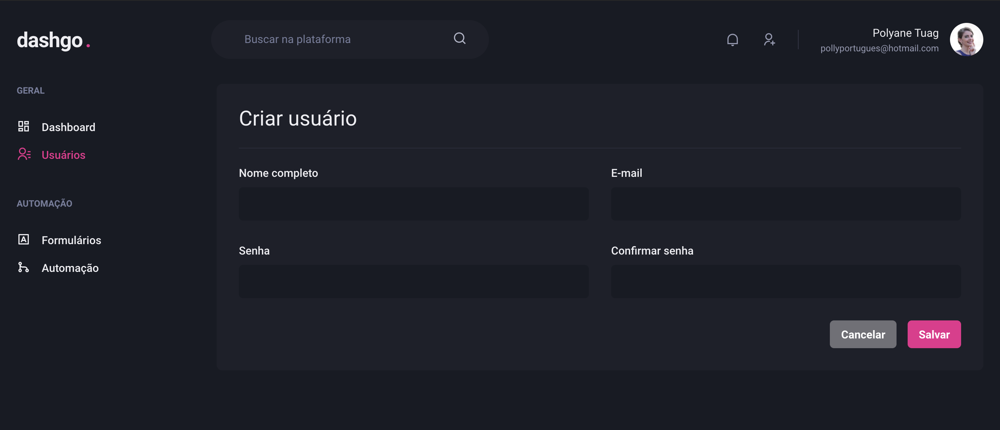

<p align="center">
  <h2 align="center">dashgo</h2>
</p>

<h3 align="center">  
  <p align="center">
    <a href="#-sobre">Sobre</a>&nbsp;&nbsp;&nbsp;|&nbsp;&nbsp;&nbsp;
    <a href="#-tecnologias">Tecnologias</a>&nbsp;&nbsp;&nbsp;|&nbsp;&nbsp;&nbsp;
    <a href="#-layouts">Layouts</a>&nbsp;&nbsp;&nbsp;|&nbsp;&nbsp;&nbsp;
    <a href="#-como-executar">Como Executar</a>&nbsp;&nbsp;&nbsp;|&nbsp;&nbsp;&nbsp;
    <a href="#-licença">Licença</a>
  </p>
</h3>

## 📚 Sobre

Para a realização do projeto, foram implementados as bibliotecas:
 - apexcharts - para a criação dos gráficos
 - chakra UI - para a customização do projeto
 - yup - para a validação dos formulários

## 🚀 Tecnologias

- ReactJS
- TypeScript
- Chakra-UI
- Apexcharts
- Yup
- Eslint
  
## 🎨 Layouts

<p align="center">Dashboard
   
</p>

<p align="center">Listagem de usuários
  
</p>

<p align="center">Criação de usuários
  
</p>


## ⏱ Como executar

Primeiro, execute o servidor de desenvolvimento:

```bash
# Clonar o repositório
$ git clone https://github.com/polyanetuag/dashgo.git

# Entrar na pasta  
$ cd dashgo

# Instalar as dependências
$ yarn 

# Iniciar o servidor
$ yarn dev
```

Depois, abra http://localhost:3000 com seu navegador para ver o resultado.

## 📝 Licença

Esse projeto está sob a licença MIT. Veja o arquivo LICENSE para mais detalhes.

---
Desenvolvido com 💜 por Polyane Tuag